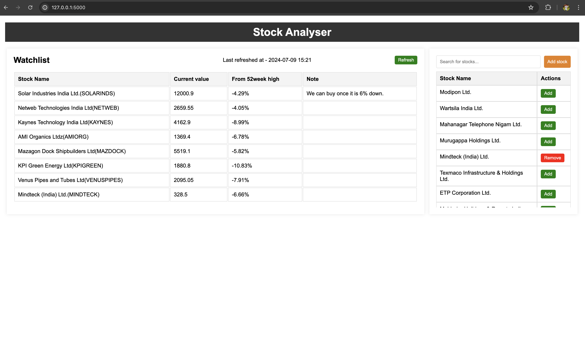

# Stock Analyser Engine
## _Project Overview_

This project was created to learn Full-Stack development, focusing initially on backend development. It has evolved into a useful analytics tool that I frequently utilize.

## _Web Interfaces_
- Primary -  [Stock Analyzer Engine on Koyeb](https://tender-nightingale-keesha-36143a60.koyeb.app)
- Backup -  [Stock Analyzer Engine on Render](https://stockanalyserengine.onrender.com)

## _Features_
- Add or Remove Stocks of your interest to Watchlist.
- Keep track of and analyze data for the stocks in your watchlist.
- Add notes to remember key points
- Seamlessly integrate new stocks into the database when they are not already present.

## _Tech Stack_
1. **Frontend:**
   - HTML
   - CSS
   - JavaScript

2. **Backend:**
   - Flask

3. **Database:**
   - MongoDB

4. **Deployment Servers:**
   - Koyeb
   - Render

## _Api Documentation_
- Link - [Documentation](https://github.com/Keertiraj-DJ/StockAnalyserEngine/blob/main/ApiDocument.txt)

## _Data source_
- Web scraping - [https://www.google.com/finance/](https://www.google.com/finance/)

## _Demo_

 

## _Installation_
- python3 -m venv <venv_name>
- source <venv_name>/bin/activate
- pip install -r requirements.txt
- flask run

## _License_
**Free Software, Yeah!**
